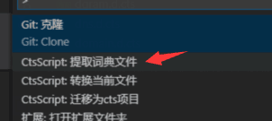

源于[早先想法](https://github.com/program-in-chinese/overview/issues/54#issuecomment-391567345), 基于CTS的API翻译表, 提取术语词典.

原始JSON文件为CTS提取的词典文件:


### 文件格式
```json
{
    "未译词典": {
        "$1": "$1",
        ...
        "zUp": "zUp"
    },
    "通用词典": {
        "@internal": "@内部",
        ...
        "zoomRectScreen": "放缩矩形屏幕"
    },
    "英汉多译": {
        "dir": "方向",
        "dir": "细节",
        "dir": "阅读顺序",
        "translate": "翻译",
        "translate": "翻转"
    },
    "汉英多译": {
        "freeze": "冻结",
        "frozen": "冻结",
        ...
        "palette": "面板",
        "pan": "面板"
    }
}
```

### 提取词条几种思路

#### 通用词典中的单个词

通用词典中, 如果本身就是单个词, 那么提取为词条. 比如`"worker": "工作者"`

问题是, 有些词组全部都是小写, 会被误认为单词, 比如`"webnotifications": "网站通知"`

#### 词组中仅剩一词不在词典

初始时, 将"汉英多译"部分词条作为"种子"词典.

遍历通用词典, 如某词组中仅有一词不在初始词典, 那么将此词和剩余翻译提取为词条

比如: "timestampOffset": "时间戳偏移", 词典中已有timestamp->时间戳, 那么剩下的词offset可提取为新词条, 释义为"偏移"
